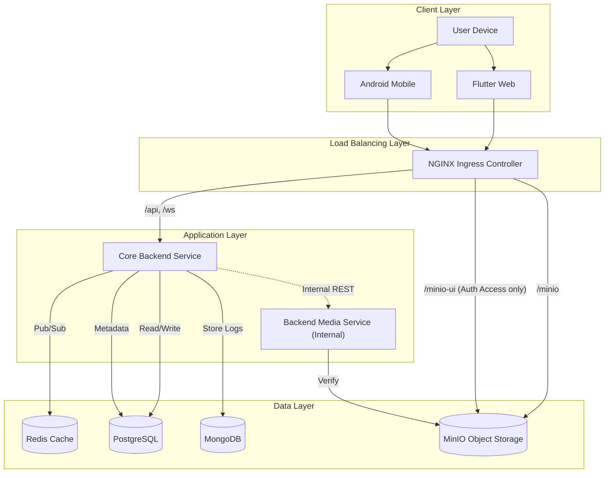
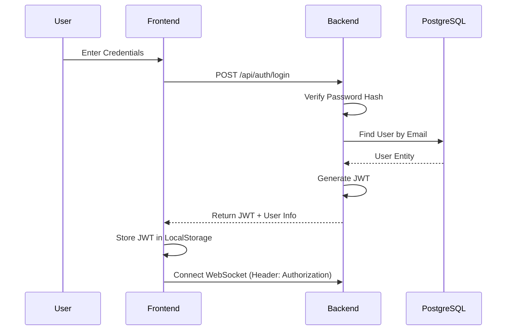
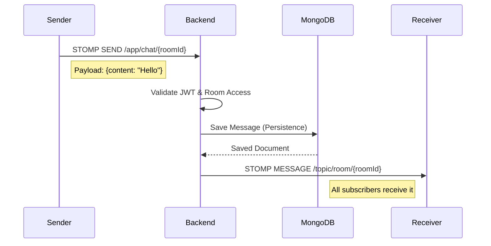
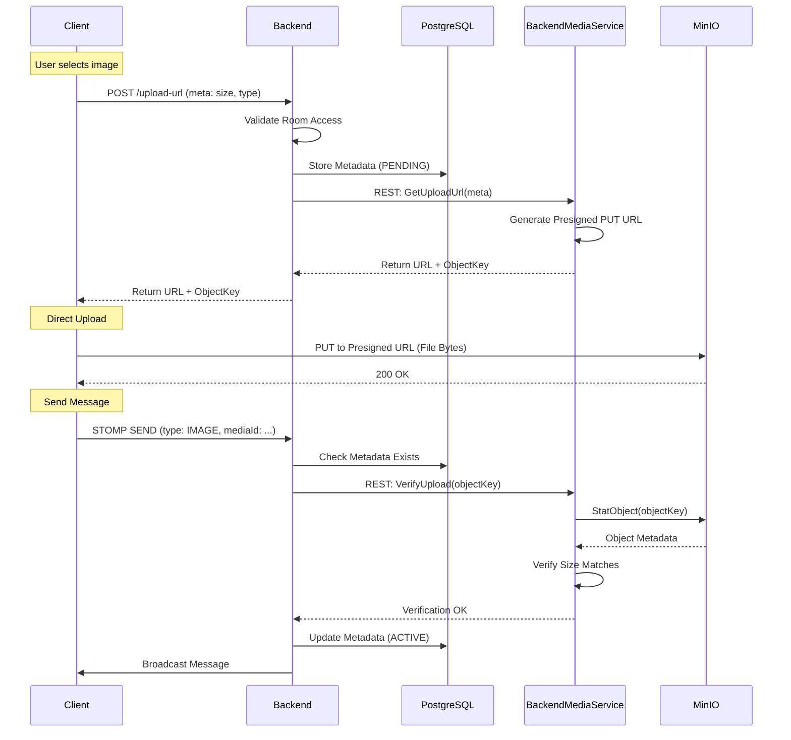

# 💬 Chat App - Ultimate Full Stack Real-time Messaging System

> **Version**: 2.0.0
> **Status**: Production Ready
> **Maintainer**: Abhishek Jain
> **License**: MIT

A robust, scalable, and modern real-time chat application built with **Spring Boot (Kotlin)** and **Flutter**, orchestrated with **Kubernetes**. This project demonstrates a microservices-ready architecture with a split-backend design for handling high-throughput messaging and heavy media processing separately.

This documentation is designed to be the **Single Source of Truth** for the entire project. It covers everything from high-level architecture to line-by-line configuration details.

---

## 📋 Table of Contents

- [💬 Chat App - Ultimate Full Stack Real-time Messaging System](#-chat-app---ultimate-full-stack-real-time-messaging-system)
  - [📋 Table of Contents](#-table-of-contents)
  - [🌟 Project Overview](#-project-overview)
    - [Key Features](#key-features)
  - [🏗 System Architecture](#-system-architecture)
    - [High-Level Design](#high-level-design)
    - [Network Flow](#network-flow)
    - [Database Architecture](#database-architecture)
  - [📂 Directory Structure \& Codebase](#-directory-structure--codebase)
    - [Root Directory](#root-directory)
    - [Backend Structure (`chat-app-backend/src/main/kotlin/...`)](#backend-structure-chat-app-backendsrcmainkotlin)
    - [Frontend Structure (`chat-app-frontend/lib/`)](#frontend-structure-chat-app-frontendlib)
  - [⚙️ Configuration Reference](#️-configuration-reference)
    - [Environment Variables](#environment-variables)
    - [Application Properties (`application.yml`)](#application-properties-applicationyml)
  - [🗄 Database Schema](#-database-schema)
    - [PostgreSQL (Relational)](#postgresql-relational)
      - [Table: `users`](#table-users)
      - [Table: `chat_rooms`](#table-chat_rooms)
      - [Table: `media_metadata`](#table-media_metadata)
    - [MongoDB (NoSQL)](#mongodb-nosql)
      - [Collection: `messages`](#collection-messages)
  - [🛡 Backend Service Deep Dive (`chat-app-backend`)](#-backend-service-deep-dive-chat-app-backend)
    - [Authentication Module](#authentication-module)
    - [WebSocket Module](#websocket-module)
    - [Media Orchestration](#media-orchestration)
  - [🖼️ Backend Media Service Deep Dive (`chat-app-backend-media`)](#️-backend-media-service-deep-dive-chat-app-backend-media)
  - [💻 Frontend Service Deep Dive (`chat-app-frontend`)](#-frontend-service-deep-dive-chat-app-frontend)
    - [Flutter Web Architecture](#flutter-web-architecture)
    - [Real-time Client](#real-time-client)
  - [☁️ Infrastructure \& DevOps](#️-infrastructure--devops)
    - [Kubernetes Manifests Explained](#kubernetes-manifests-explained)
      - [`k8s/backend.yaml`](#k8sbackendyaml)
      - [`k8s/media-service.yaml`](#k8smedia-serviceyaml)
      - [`k8s/ingress.yaml`](#k8singressyaml)
      - [`k8s/mongo.yaml` \& `k8s/postgres.yaml`](#k8smongoyaml--k8spostgresyaml)
    - [Dockerfiles](#dockerfiles)
  - [🔄 Detailed Workflows \& Sequence Diagrams](#-detailed-workflows--sequence-diagrams)
    - [User Authentication Flow](#user-authentication-flow)
    - [Real-time Message Delivery](#real-time-message-delivery)
    - [Secure Media Upload Flow](#secure-media-upload-flow)
  - [📡 API Documentation](#-api-documentation)
    - [Auth API](#auth-api)
      - [Login](#login)
      - [Register](#register)
    - [Room API](#room-api)
      - [List Rooms](#list-rooms)
      - [Create Room](#create-room)
    - [Media API](#media-api)
      - [Get Upload URL](#get-upload-url)
      - [Send Media Message](#send-media-message)
  - [🔌 WebSocket Protocol Guide](#-websocket-protocol-guide)
    - [Connecting](#connecting)
    - [Subscribing](#subscribing)
    - [Sending Messages](#sending-messages)
  - [🚀 Deployment Guide](#-deployment-guide)
    - [Prerequisites](#prerequisites)
    - [1. Host Configuration](#1-host-configuration)
    - [2. Environment Setup](#2-environment-setup)
    - [3. Automated Deployment](#3-automated-deployment)
    - [4. Verification](#4-verification)
    - [5. Access](#5-access)
    - [🔄 Updating Deployments](#-updating-deployments)
    - [🛑 Managing the Cluster (Stop/Start)](#-managing-the-cluster-stopstart)
  - [👨‍💻 Developer Guide](#-developer-guide)
    - [Adding a New Feature](#adding-a-new-feature)
    - [Code Style](#code-style)
  - [📉 Load Testing \& Performance](#-load-testing--performance)
    - [Scenarios](#scenarios)
    - [Running a Test](#running-a-test)
    - [Monitoring HPA](#monitoring-hpa)
  - [🐛 Troubleshooting](#-troubleshooting)
    - [1. "Upload Failed" or 403 Forbidden on Upload](#1-upload-failed-or-403-forbidden-on-upload)
    - [2. WebSocket Connection Fails](#2-websocket-connection-fails)
    - [3. Database Connection Refused](#3-database-connection-refused)
    - [4. Frontend "CORS Error"](#4-frontend-cors-error)
    - [5. Image Not Loading](#5-image-not-loading)
  - [📚 Appendix A: Full Kubernetes Manifest Examples](#-appendix-a-full-kubernetes-manifest-examples)
    - [`k8s/ingress.yaml`](#k8singressyaml-1)
  - [📚 Appendix B: NGINX Configuration (Local Docker)](#-appendix-b-nginx-configuration-local-docker)
  - [📚 Appendix C: Common Error Codes](#-appendix-c-common-error-codes)
  - [📚 Appendix D: Security Checklist](#-appendix-d-security-checklist)

---

## 🌟 Project Overview

This application is not just a chat app; it's a reference implementation for building scalable real-time systems. It solves common challenges such as:
*   **Handling High Concurrency**: Using reactive patterns and efficient WebSocket management.
*   **Large File Handling**: Offloading media processing to a dedicated service and using direct-to-storage uploads.
*   **Hybrid Storage**: Combining Relational (PostgreSQL) and NoSQL (MongoDB) databases for optimal performance.
*   **Cross-Platform UI**: A single codebase for Web, Android, and iOS using Flutter.

### Key Features
*   **Real-time Messaging**: Sub-millisecond message delivery using STOMP over WebSockets.
*   **Media Sharing**: Secure, verified image uploads using MinIO presigned URLs.
*   **Scalability**: Horizontal Pod Autoscaling (HPA) for backend services.
*   **Resilience**: Circuit breakers, retries, and self-healing Kubernetes pods.
*   **Observability**: Prometheus metrics and K6 load testing integration.

---

## 🏗 System Architecture

### High-Level Design

The system follows a **Microservices-Lite** pattern. We have two distinct backend services:
1.  **Core Backend**: Handles business logic, auth, and messaging.
2.  **Backend Media Service**: Handles file I/O, storage interaction, and verification.

These services communicate internally within the Kubernetes cluster, while the frontend interacts primarily with the Core Backend and directly with Object Storage (MinIO) for uploads.



### Network Flow

1.  **Ingress**: All external traffic hits `chat.abhishek.com`. The NGINX Ingress Controller routes traffic based on paths:
    *   `/` -> Frontend Service (Flutter Web Assets)
    *   `/backend/` -> Core Backend Service (API & WebSocket)
    *   `/minio/` -> MinIO Service (S3 API for direct downloads/uploads)
    *   `/minio-ui/` -> MinIO Console (Requires Username/Password Authentication)
2.  **Service Discovery**: Kubernetes Services (`ClusterIP`) allow pods to communicate internally using DNS names (e.g., `backend`, `media-service`, `mongo`).
3.  **Internal Communication**: The Core Backend talks to the Backend Media Service via HTTP on the internal cluster network. This API is NOT exposed to the public internet.

### Database Architecture

We use a **Polyglot Persistence** strategy:

| Database       | Role                  | Justification                                                                                                                                    |
| :------------- | :-------------------- | :----------------------------------------------------------------------------------------------------------------------------------------------- |
| **PostgreSQL** | **Relational Data**   | Users, Rooms, and Media Metadata require strict schema enforcement, ACID transactions, and complex joins.                                        |
| **MongoDB**    | **Chat Logs**         | Chat messages are high-volume, append-only, and unstructured. MongoDB offers superior write throughput and flexible schema for message payloads. |
| **Redis**      | **Caching & Pub/Sub** | Used for caching user sessions and potentially for distributing WebSocket messages across multiple backend replicas (future proofing).           |
| **MinIO**      | **Object Storage**    | S3-compatible storage for binary data (images, videos). Decouples file storage from the application server.                                      |

---

## 📂 Directory Structure & Codebase

Understanding the project structure is crucial for navigation.

### Root Directory
*   `chat-app-backend/`: The Spring Boot Core Service.
*   `chat-app-backend-media/`: The Spring Boot Backend Media Service.
*   `chat-app-frontend/`: The Flutter Application.
*   `k8s/`: Kubernetes Manifests.
*   `tests/k6/`: Load Testing Scripts.
*   `setup-cluster.sh`: Main deployment script.
*   `deploy.sh`: Service update script.

### Backend Structure (`chat-app-backend/src/main/kotlin/...`)
*   `config/`:
    *   `SecurityConfig.kt`: Configures JWT filter chain and CORS.
    *   `WebSocketConfig.kt`: Configures STOMP endpoints and message broker.
    *   `AppConfig.kt`: General beans (RestTemplate, etc.).
*   `controller/`:
    *   `AuthController.kt`: Login/Register endpoints.
    *   `RoomController.kt`: Room management and message sending.
    *   `ChatController.kt`: WebSocket message handling (`@MessageMapping`).
*   `service/`:
    *   `AuthService.kt`: Business logic for user management.
    *   `RoomService.kt`: Room creation and listing.
    *   `MessageService.kt`: Saving messages to Mongo.
    *   `MediaMetadataService.kt`: Handling media metadata.
*   `model/`: JPA Entities (`User`, `ChatRoom`).
*   `document/`: Mongo Documents (`Message`).
*   `repository/`: Interfaces extending `JpaRepository` or `MongoRepository`.

### Frontend Structure (`chat-app-frontend/lib/`)
*   `main.dart`: Entry point, sets up Providers and Routes.
*   `config/`:
    *   `api_constants.dart`: Centralized API URLs.
    *   `theme.dart`: App visual style.
*   `notifiers/`:
    *   `auth_notifier.dart`: Handles login state.
    *   `chat_notifier.dart`: Handles active room and messages.
    *   `media_upload_notifier.dart`: Handles file upload queue.
*   `screens/`:
    *   `login_screen.dart`: Auth UI.
    *   `home_screen.dart`: Room list.
    *   `chat_room_screen.dart`: Message list and input.
*   `services/`:
    *   `api_service.dart`: HTTP calls (Dio/Http).
    *   `socket_service.dart`: WebSocket management.
    *   `media_service.dart`: MinIO upload logic.

---

## ⚙️ Configuration Reference

### Environment Variables
These variables must be set in your `.env` file (or K8s Secrets).

| Variable                   | Default (Local) | Description                                      |
| :------------------------- | :-------------- | :----------------------------------------------- |
| **Database**               |                 |                                                  |
| `DB_HOST`                  | `postgres`      | Hostname of the PostgreSQL service.              |
| `DB_PORT`                  | `5432`          | Port for PostgreSQL.                             |
| `DB_NAME`                  | `chatapp`       | Name of the database.                            |
| `DB_USER`                  | `chatuser`      | Username for DB access.                          |
| `DB_PASS`                  | `chatpass`      | Password for DB access.                          |
| **MongoDB**                |                 |                                                  |
| `MONGO_HOST`               | `mongo`         | Hostname of the MongoDB service.                 |
| `MONGO_PORT`               | `27017`         | Port for MongoDB.                                |
| `MONGO_USER`               | `chatuser`      | Username for Mongo access.                       |
| `MONGO_PASSWORD`           | `chatpass`      | Password for Mongo access.                       |
| `MONGO_DB`                 | `chatapp`       | Name of the Mongo database.                      |
| `MONGO_AUTH_DB`            | `admin`         | Auth database for Mongo.                         |
| **Redis**                  |                 |                                                  |
| `REDIS_HOST`               | `redis`         | Hostname of Redis service.                       |
| `REDIS_PORT`               | `6379`          | Port for Redis.                                  |
| **Security**               |                 |                                                  |
| `JWT_SECRET`               | *Required*      | 256-bit secret key for signing JWTs.             |
| `JWT_EXPIRATION`           | `604800`        | Token validity in seconds (7 days).              |
| **MinIO**                  |                 |                                                  |
| `MINIO_ROOT_USER`          | `minioadmin`    | Admin username for MinIO.                        |
| `MINIO_ROOT_PASSWORD`      | `minioadmin`    | Admin password for MinIO.                        |
| `MINIO_BUCKET`             | `chat-media`    | Bucket name for media storage.                   |
| `MINIO_PUBLIC_URL`         | `http://...`    | Publicly accessible URL for the bucket.          |
| **Backend Media Service**  |                 |                                                  |
| `MEDIA_MAX_FILE_SIZE`      | `10485760`      | Max upload size in bytes (10MB).                 |
| `MEDIA_ALLOWED_MIME_TYPES` | `image/*`       | Comma-separated allowed MIME types.              |
| `MEDIA_SERVICE_TOKEN`      | *Required*      | Shared secret for Backend<->Media communication. |

### Application Properties (`application.yml`)
Key settings in the Spring Boot configuration:

```yaml
spring:
  profiles:
    active: prod # Activates the prod profile which reads env vars
  jpa:
    hibernate:
      ddl-auto: update # Automatically updates DB schema (use 'validate' in real prod)
server:
  port: 8080 # Internal container port
jwt:
  secret: ${JWT_SECRET}
media:
  service:
    url: http://backend-media:8081 # Internal DNS name
```

---

## 🗄 Database Schema

### PostgreSQL (Relational)

#### Table: `users`
Stores user account information.
| Column       | Type        | Constraints        | Description             |
| :----------- | :---------- | :----------------- | :---------------------- |
| `id`         | `BIGSERIAL` | `PK`               | Unique User ID.         |
| `email`      | `VARCHAR`   | `UNIQUE, NOT NULL` | User email address.     |
| `password`   | `VARCHAR`   | `NOT NULL`         | BCrypt hashed password. |
| `name`       | `VARCHAR`   | `NOT NULL`         | Display name.           |
| `created_at` | `TIMESTAMP` |                    | Account creation time.  |

#### Table: `chat_rooms`
Stores available chat rooms.
| Column        | Type      | Constraints | Description                  |
| :------------ | :-------- | :---------- | :--------------------------- |
| `id`          | `VARCHAR` | `PK`        | UUID of the room.            |
| `name`        | `VARCHAR` | `NOT NULL`  | Room name (e.g., "General"). |
| `description` | `TEXT`    |             | Room topic.                  |

#### Table: `media_metadata`
Tracks the lifecycle of uploaded files.
| Column        | Type      | Constraints       | Description           |
| :------------ | :-------- | :---------------- | :-------------------- |
| `id`          | `VARCHAR` | `PK`              | UUID of the media.    |
| `object_key`  | `VARCHAR` | `UNIQUE`          | Path in MinIO bucket. |
| `status`      | `ENUM`    | `PENDING, ACTIVE` | Upload status.        |
| `size_bytes`  | `BIGINT`  |                   | File size.            |
| `mime_type`   | `VARCHAR` |                   | Content type.         |
| `uploader_id` | `BIGINT`  | `FK -> users`     | Who uploaded it.      |

### MongoDB (NoSQL)

#### Collection: `messages`
Stores the actual chat history.
```text
{
  "_id": "ObjectId(...)",
  "roomId": "room-uuid",
  "senderId": 123,
  "senderName": "John Doe",
  "content": "Hello world!",
  "messageType": "TEXT", // or "IMAGE"
  "timestamp": "ISODate(\"2023-11-29T...\")",
  "media": { // Optional, present if messageType is IMAGE
    "mediaId": "media-uuid",
    "url": "http://chat.abhishek.com/minio/...",
    "width": 1024,
    "height": 768
  }
}
```

---

## 🛡 Backend Service Deep Dive (`chat-app-backend`)

### Authentication Module
The authentication flow is designed to be stateless and secure.
1.  **Registration**: `POST /api/auth/register` creates a new `User` entity. Password is hashed using `BCryptPasswordEncoder`.
2.  **Login**: `POST /api/auth/login` verifies credentials. If valid, it generates a JWT containing the user's email and ID.
3.  **Token Validation**: The `JwtAuthenticationFilter` runs before every request. It parses the `Authorization` header, validates the signature using `JWT_SECRET`, and sets the `SecurityContextHolder`.

### WebSocket Module
We use Spring's built-in STOMP support.
*   **Endpoint**: `/ws` (with SockJS fallback options).
*   **Message Broker**: An in-memory broker handles routing messages from `/app` destinations to `/topic` subscribers.
*   **Interceptors**: `WebSocketChannelInterceptor` extracts the JWT from the `CONNECT` frame headers to authenticate the WebSocket session.

### Media Orchestration
The backend acts as a coordinator for media uploads but does not handle the bytes itself.
1.  Receives upload request from client.
2.  Validates user permissions (is the user in this room?).
3.  Calls `Backend Media Service` to generate a presigned URL.
4.  Returns URL to client.
5.  Receives "Upload Complete" signal from client.
6.  updates meta data of file info.
7.  If verified, creates a `Message` with type `IMAGE` and broadcasts it.

---

## 🖼️ Backend Media Service Deep Dive (`chat-app-backend-media`)

This service is a specialized worker. It has no public API.
*   **Port**: 8081
*   **Security**: Protected by a shared secret token (`MEDIA_SERVICE_TOKEN`).
*   **Responsibilities**:
    *   **Presigned URL Generation**: Uses MinIO SDK to create PUT URLs valid for 10 minutes.
    *   **File Verification**: Uses `minioClient.statObject()` to check if a file exists and matches the expected size.
    *   **Metadata Management**: Updates the `media_metadata` table in Postgres.

---

## 💻 Frontend Service Deep Dive (`chat-app-frontend`)

### Flutter Web Architecture
The app is built using Flutter's widget tree system.
*   **`MaterialApp`**: The root widget, configuring themes and routes.
*   **`Scaffold`**: Provides the basic layout structure (AppBar, Body).


### Real-time Client
The `SocketService` wraps the `stomp_dart_client`.
*   **Connection**:
    ```text
    StompClient(
      config: StompConfig(
        url: 'ws://chat.abhishek.com/backend/ws',
        onConnect: _onConnect,
        webSocketConnectHeaders: {'Authorization': 'Bearer $token'},
      )
    )
    ```
*   **Subscription**:
    ```text
    client.subscribe(
      destination: '/topic/room/$roomId',
      callback: (frame) => _handleMessage(frame),
    );
    ```

---

## ☁️ Infrastructure & DevOps

### Kubernetes Manifests Explained

#### `k8s/backend.yaml`
Defines the Deployment and Service for the Core Backend.
*   **Deployment**:
    *   `replicas: 2`: Starts with 2 pods.
    *   `readinessProbe`: Checks `/actuator/health`. K8s won't send traffic until this passes.
    *   `livenessProbe`: Restarts pod if this fails.
    *   `resources`: Requests 500m CPU, 512Mi RAM.
*   **HPA**: Autoscales up to 4 replicas if CPU > 70%.

#### `k8s/media-service.yaml`
Similar to backend, but for the internal media service. Not exposed via Ingress.

#### `k8s/ingress.yaml`
The entry point for the cluster.
*   **Annotations**:
    *   `nginx.org/websocket-services`: Tells NGINX to upgrade connections for the backend.
    *   `nginx.ingress.kubernetes.io/proxy-body-size`: "2048m" to allow large uploads to MinIO.

#### `k8s/mongo.yaml` & `k8s/postgres.yaml`
StatefulSets for databases. In a real production environment, you would use a managed service (RDS/Atlas), but for this self-contained setup, we run them in-cluster.

### Dockerfiles
We use **Multi-Stage Builds** to keep images small.
1.  **Build Stage**: Uses a Maven/JDK image to compile the code.
2.  **Run Stage**: Uses a slim JRE image (Eclipse Temurin) to run the jar.
This reduces image size from ~800MB to ~200MB.

---

## 🔄 Detailed Workflows & Sequence Diagrams

### User Authentication Flow



### Real-time Message Delivery



### Secure Media Upload Flow

This is the most complex flow, involving all systems.



---

## 📡 API Documentation

### Auth API

#### Login
*   **Endpoint**: `POST /api/auth/login`
*   **Description**: Authenticates a user and returns a JWT.
*   **Request Body**:
    ```json
    {
      "email": "user@example.com",
      "password": "password123"
    }
    ```
*   **Response (200 OK)**:
    ```json
    {
      "token": "eyJhbGciOiJIUzI1NiJ9...",
      "userId": 1,
      "name": "User Name",
      "email": "user@example.com"
    }
    ```

#### Register
*   **Endpoint**: `POST /api/auth/register`
*   **Description**: Creates a new user account.
*   **Request Body**:
    ```json
    {
      "email": "newuser@example.com",
      "password": "password123",
      "name": "New User"
    }
    ```

### Room API

#### List Rooms
*   **Endpoint**: `GET /api/rooms`
*   **Headers**: `Authorization: Bearer <token>`
*   **Response**:
    ```json
    [
      {
        "id": "room-uuid-1",
        "name": "General",
        "description": "General discussion"
      }
    ]
    ```

#### Create Room
*   **Endpoint**: `POST /api/rooms`
*   **Request Body**:
    ```json
    {
      "name": "Tech Talk",
      "description": "Discussing technology"
    }
    ```

### Media API

#### Get Upload URL
*   **Endpoint**: `POST /api/rooms/{roomId}/media/upload-url`
*   **Description**: Requests a presigned URL to upload a file to MinIO.
*   **Request Body**:
    ```json
    {
      "fileName": "photo.jpg",
      "mimeType": "image/jpeg",
      "sizeBytes": 102400
    }
    ```
*   **Response**:
    ```json
    {
      "uploadUrl": "http://chat.abhishek.com/minio/chat-media/...?signature=...",
      "publicUrl": "http://chat.abhishek.com/minio/chat-media/rooms/...",
      "mediaId": "media-uuid",
      "objectKey": "rooms/..."
    }
    ```

#### Send Media Message
*   **Endpoint**: `POST /api/rooms/{roomId}/messages`
*   **Description**: Sends a message with an attached media file (after upload).
*   **Request Body**:
    ```json
    {
      "content": "Check this out!",
      "messageType": "IMAGE",
      "media": {
        "mediaId": "media-uuid",
        "objectKey": "rooms/...",
        "mimeType": "image/jpeg",
        "sizeBytes": 102400
      }
    }
    ```

---

## 🔌 WebSocket Protocol Guide

### Connecting
Client must connect to `ws://chat.abhishek.com/backend/ws`.
**Headers**:
*   `Authorization`: `Bearer <jwt_token>`

### Subscribing
To receive messages for a room, subscribe to:
`/topic/room/{roomId}`

### Sending Messages
To send a message, send a STOMP frame to:
`/app/chat/{roomId}`
**Payload**:
```json
{
  "content": "Hello world",
  "messageType": "TEXT"
}
```

---

## 🚀 Deployment Guide

### Prerequisites
*   **Docker Desktop**: Running.
*   **Kind**: `brew install kind`
*   **Kubectl**: `brew install kubectl`
*   **Gettext**: `brew install gettext` (for `envsubst`)

### 1. Host Configuration
Map the local domain to your machine.
```bash
# /etc/hosts
127.0.0.1 chat.abhishek.com
```

### 2. Environment Setup
Create a `.env` file in the root directory.
```bash
cp .env.example .env
# Edit .env with your desired passwords/secrets
```

### 3. Automated Deployment
We have a unified script to set up the entire cluster.
```bash
chmod +x setup-cluster.sh
./setup-cluster.sh
```
**What this script does:**
1.  Checks for Kind cluster `chat-cluster`. Creates if missing.
2.  Installs NGINX Ingress Controller.
3.  Builds Docker images for Backend, Backend Media Service, and Frontend.
4.  Loads images into the Kind control plane.
5.  Generates K8s configs from `.env` using `envsubst`.
6.  Applies all manifests (`k8s/*.yaml`).
7.  Waits for pods to be ready.

### 4. Verification
```bash
kubectl get pods -n chat-app
```
All pods should be `Running`.

### 5. Access
Open your browser to **[http://chat.abhishek.com](http://chat.abhishek.com)**.

### 🔄 Updating Deployments
If you make changes to the code, you can easily rebuild and redeploy individual services using the `deploy.sh` script:

```bash
chmod +x deploy.sh

# Deploy Backend updates
./deploy.sh backend

# Deploy Backend media updates
./deploy.sh backend-media

# Deploy Frontend updates
./deploy.sh frontend
```

### 🛑 Managing the Cluster (Stop/Start)
Since **Kind** runs as Docker containers, you can pause and resume your cluster to save resources without losing data.

**To Stop (Pause) the Cluster:**
```bash
docker stop $(docker ps -q --filter "name=chat-cluster")
```

**To Start (Resume) the Cluster:**
```bash
docker start $(docker ps -a -q --filter "name=chat-cluster")
```

**To Destroy the Cluster (Delete Everything):**
```bash
kind delete cluster --name chat-cluster
```

---

## 👨‍💻 Developer Guide

### Adding a New Feature
1.  **Backend**:
    *   Create DTO in `dto/`.
    *   Add Service method in `service/`.
    *   Add Controller endpoint in `controller/`.
    *   Update `SecurityConfig` if new public endpoints are needed.
2.  **Frontend**:
    *   Add model in `models/`.
    *   Add API method in `ApiService`.
    *   Create Screen/Widget.
3.  **Test**:
    *   Run backend locally: `./mvnw spring-boot:run`
    *   Run frontend locally: `flutter run -d chrome`

### Code Style
*   **Kotlin**: Follow standard Kotlin conventions. Use `val` over `var`.
*   **Flutter**: Use `const` constructors where possible. Follow lint rules.

---

## 📉 Load Testing & Performance

We use **K6** for load testing. The tests are located in `tests/k6/`.

### Scenarios
1.  **Smoke Test**: 1 user, low load. Verifies system health.
2.  **Load Test**: 10-50 users. Verifies concurrency and HPA scaling.
3.  **Stress Test**: 100+ users. Finds the breaking point.

### Running a Test
```bash
# Install K6
brew install k6

# Run Load Test
k6 run tests/k6/load_test.js
```

### Monitoring HPA
While the test runs, watch the autoscaler react:
```bash
watch kubectl get hpa -n chat-app
```
You should see the `TARGETS` CPU % rise, and `REPLICAS` increase from 2 to 4.

---

## 🐛 Troubleshooting

### 1. "Upload Failed" or 403 Forbidden on Upload
*   **Cause**: MinIO presigned URL expired or clock skew.
*   **Fix**: Check system time. Ensure `MINIO_PUBLIC_URL` in `.env` matches the browser-accessible URL (`http://chat.abhishek.com/minio`).

### 2. WebSocket Connection Fails
*   **Cause**: NGINX configuration not upgrading headers.
*   **Fix**: Ensure `ingress.yaml` has the correct WebSocket annotations:
    ```yaml
    nginx.org/websocket-services: "backend"
    ```

### 3. Database Connection Refused
*   **Cause**: Pods starting before DB is ready.
*   **Fix**: The backend uses an `initContainer` to wait for Postgres/Mongo. If it still fails, check PVCs: `kubectl get pvc -n chat-app`.

### 4. Frontend "CORS Error"
*   **Cause**: Backend not allowing origin `chat.abhishek.com`.
*   **Fix**: Check `WebConfig.kt` in backend. It should allow `AllowedOrigins`.

### 5. Image Not Loading
*   **Cause**: Browser cannot resolve `minio` hostname if running outside cluster context without `/etc/hosts` or Ingress routing.
*   **Fix**: Ensure the image URL starts with `http://chat.abhishek.com/minio/...`.

---

## 📚 Appendix A: Full Kubernetes Manifest Examples

For reference, here are the critical configuration files used in the cluster.

### `k8s/ingress.yaml`
This file controls all external access to the cluster. Note the specific annotations for MinIO large file uploads.

```yaml
apiVersion: networking.k8s.io/v1
kind: Ingress
metadata:
  name: chat-app-ingress
  namespace: chat-app
  annotations:
    nginx.ingress.kubernetes.io/rewrite-target: /$2
    nginx.ingress.kubernetes.io/use-regex: "true"
    nginx.ingress.kubernetes.io/backend-protocol: "HTTP"
    nginx.ingress.kubernetes.io/proxy-read-timeout: "3600"
    nginx.ingress.kubernetes.io/proxy-send-timeout: "3600"
    nginx.ingress.kubernetes.io/enable-cors: "true"
    nginx.ingress.kubernetes.io/cors-allow-origin: "*"
    nginx.ingress.kubernetes.io/cors-allow-methods: "GET, PUT, POST, DELETE, OPTIONS"
    nginx.ingress.kubernetes.io/cors-allow-headers: "Content-Type, Authorization, x-amz-content-sha256, x-amz-date"
spec:
  ingressClassName: nginx
  rules:
    - host: chat.abhishek.com
      http:
        paths:
          - path: /backend(/|$)(.*)
            pathType: ImplementationSpecific
            backend:
              service:
                name: backend
                port:
                  number: 8080
          - path: /()(.*)
            pathType: ImplementationSpecific
            backend:
              service:
                name: frontend
                port:
                  number: 80
---
# ---------------------------------------------------------
# 2. MinIO Specific Ingress (High Performance Uploads)
# Customized for 2GB+ files and streaming
# ---------------------------------------------------------
apiVersion: networking.k8s.io/v1
kind: Ingress
metadata:
  name: chat-app-minio-ingress
  namespace: chat-app
  annotations:
    nginx.ingress.kubernetes.io/rewrite-target: /$2
    nginx.ingress.kubernetes.io/use-regex: "true"
    nginx.ingress.kubernetes.io/upstream-vhost: "minio:9000"
    nginx.ingress.kubernetes.io/proxy-body-size: "2048m"
    nginx.ingress.kubernetes.io/proxy-request-buffering: "off"
    nginx.ingress.kubernetes.io/proxy-read-timeout: "3600"
    nginx.ingress.kubernetes.io/proxy-send-timeout: "3600"
    nginx.ingress.kubernetes.io/enable-cors: "true"
    nginx.ingress.kubernetes.io/cors-allow-origin: "https?://(localhost|chat\\.abhishek\\.com)(:[0-9]+)?"
    nginx.ingress.kubernetes.io/cors-allow-methods: "GET, PUT, POST, DELETE, OPTIONS"
    nginx.ingress.kubernetes.io/cors-allow-credentials: "true"
spec:
  ingressClassName: nginx
  rules:
    - host: chat.abhishek.com
      http:
        paths:
          - path: /minio(/|$)(.*)
            pathType: ImplementationSpecific
            backend:
              service:
                name: minio
                port:
                  number: 9000
          - path: /minio-ui(/|$)(.*)
            pathType: ImplementationSpecific
            backend:
              service:
                name: minio
                port:
                  number: 9001
```

---

## 📚 Appendix B: NGINX Configuration (Local Docker)

If running with `docker-compose` instead of Kubernetes, this `nginx.conf` handles the routing.

```nginx
events {
    worker_connections 1024;
}

http {
    upstream backend {
        server chat-backend:8080;
    }

    server {
        listen 80;
        server_name localhost;

        # API routes
        location /api/ {
            proxy_pass http://backend;
            proxy_set_header Host $host;
            proxy_set_header X-Real-IP $remote_addr;
            proxy_set_header X-Forwarded-For $proxy_add_x_forwarded_for;
            proxy_set_header X-Forwarded-Proto $scheme;
        }

        # WebSocket routes
        location /ws/ {
            proxy_pass http://backend;
            proxy_http_version 1.1;
            proxy_set_header Upgrade $http_upgrade;
            proxy_set_header Connection "upgrade";
            proxy_set_header Host $host;
            proxy_set_header X-Real-IP $remote_addr;
            proxy_set_header X-Forwarded-For $proxy_add_x_forwarded_for;
            proxy_set_header X-Forwarded-Proto $scheme;
            proxy_cache_bypass $http_upgrade;
        }

        # Actuator endpoints
        location /actuator/ {
            proxy_pass http://backend;
            proxy_set_header Host $host;
            proxy_set_header X-Real-IP $remote_addr;
            proxy_set_header X-Forwarded-For $proxy_add_x_forwarded_for;
            proxy_set_header X-Forwarded-Proto $scheme;
        }

        # Swagger UI
        location /swagger-ui {
            proxy_pass http://backend;
            proxy_set_header Host $host;
            proxy_set_header X-Real-IP $remote_addr;
            proxy_set_header X-Forwarded-For $proxy_add_x_forwarded_for;
            proxy_set_header X-Forwarded-Proto $scheme;
        }

        location /api-docs {
            proxy_pass http://backend;
            proxy_set_header Host $host;
            proxy_set_header X-Real-IP $remote_addr;
            proxy_set_header X-Forwarded-For $proxy_add_x_forwarded_for;
            proxy_set_header X-Forwarded-Proto $scheme;
        }

        # Health check
        location /health {
            return 200 'OK';
            add_header Content-Type text/plain;
        }
    }
}
```

---

## 📚 Appendix C: Common Error Codes

When interacting with the API, you may encounter these standard error codes.

| Status Code | Error                   | Description                                                                      | Action                                              |
| :---------- | :---------------------- | :------------------------------------------------------------------------------- | :-------------------------------------------------- |
| `400`       | `Bad Request`           | Invalid input (e.g., missing email, file too large).                             | Check your request body and headers.                |
| `401`       | `Unauthorized`          | Missing or invalid JWT token.                                                    | Log in again to get a fresh token.                  |
| `403`       | `Forbidden`             | Valid token, but insufficient permissions (e.g., accessing someone else's room). | Verify user roles and room membership.              |
| `404`       | `Not Found`             | Resource (User, Room, Message) does not exist.                                   | Check the ID in the URL.                            |
| `413`       | `Payload Too Large`     | Uploaded file exceeds `MEDIA_MAX_FILE_SIZE`.                                     | Compress the image or increase the limit in `.env`. |
| `500`       | `Internal Server Error` | Unhandled exception in backend.                                                  | Check backend logs (`kubectl logs -l app=backend`). |
| `503`       | `Service Unavailable`   | Database or Backend Media Service is down.                                       | Check pod status (`kubectl get pods`).              |

---

## 📚 Appendix D: Security Checklist

Before deploying to production, ensure the following:

1.  [ ] **Change Default Passwords**: Update `DB_PASS`, `MONGO_PASSWORD`, `MINIO_ROOT_PASSWORD` in `.env`.
2.  [ ] **Rotate JWT Secret**: Generate a strong random string for `JWT_SECRET`.
3.  [ ] **Enable HTTPS**: Configure TLS in the Ingress Controller (using Cert-Manager).
4.  [ ] **Restrict CORS**: Update `ingress.yaml` to only allow your specific frontend domain.
5.  [ ] **Resource Limits**: Tune CPU/Memory requests in `backend.yaml` based on load test results.
6.  [ ] **Network Policies**: Restrict internal traffic so only Backend can talk to DBs.

---

**End of Documentation**
