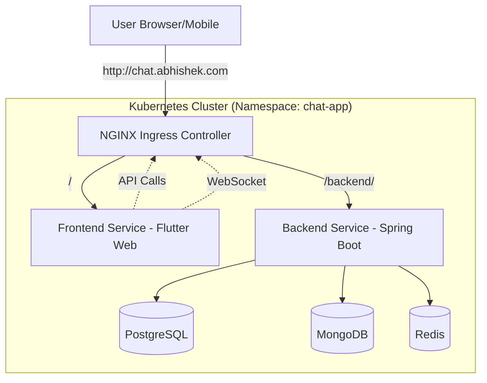
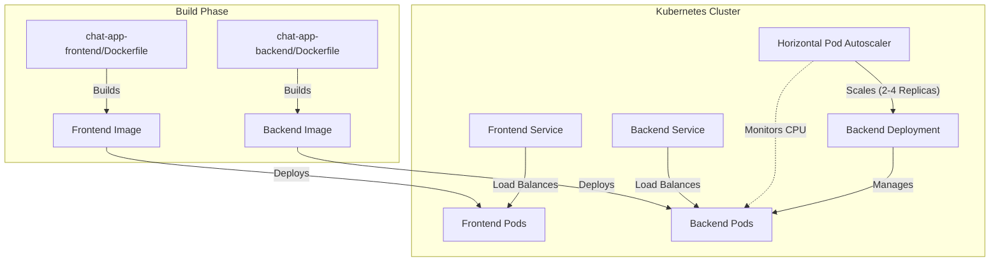

# 💬 Chat App - Full Stack Real-time Messaging

A robust, scalable, and modern real-time chat application built with **Spring Boot (Kotlin)** and **Flutter**, orchestrated with **Kubernetes**.

## 📋 Table of Contents
1.  [System Architecture](#-system-architecture)
2.  [Backend Service (Kotlin/Spring Boot)](#1--backend-chat-app-backend)
3.  [Frontend Service (Flutter)](#2--frontend-chat-app-frontend)
4.  [Database & Infrastructure](#-database--infrastructure)
5.  [Docker & Kubernetes Setup](#-docker--kubernetes-setup)
6.  [Deployment Guide](#-deployment-guide)
7.  [API Documentation](#-api-documentation)
8.  [Load Testing](#-load-testing)

---

## 🏗 System Architecture

The application is designed as a microservices-ready architecture, containerized with Docker and deployed on Kubernetes.



---

## 🧩 Services Overview

### 1. 🛡 Backend (`chat-app-backend`)
**Technology**: Kotlin, Spring Boot 3.x, Java 21
**Role**: The core logic handler for the application.

The backend is written in **Kotlin**, leveraging its concise syntax and null-safety features while running on the robust Spring Boot ecosystem.

#### Key Features:
*   **Real-time Messaging**: Uses **STOMP over WebSocket** for instant message delivery.
*   **Security**: Implements **JWT (JSON Web Token)** authentication with Spring Security.
*   **Data Persistence**:
    *   **JPA/Hibernate**: For relational data (Users, Rooms) in PostgreSQL.
    *   **Spring Data MongoDB**: For high-volume chat logs in MongoDB.
*   **Caching**: Uses **Redis** for caching frequently accessed data.

#### Project Structure:
```
chat-app-backend/src/main/kotlin/com/abhishek/chat_app_backend/
├── config/          # Security, WebSocket, and CORS configuration
├── controller/      # REST Controllers (AuthController, ChatController)
├── model/           # JPA Entities and MongoDB Documents
├── repository/      # Data Access Layers (JPA & Mongo Repositories)
├── service/         # Business Logic
└── ...
```
## 📡 API Documentation

### Authentication
*   `POST /api/auth/login`: Login with username/password. Returns JWT.
*   `POST /api/auth/register`: Register a new user.

### Chat Rooms
*   `GET /api/rooms`: List all available chat rooms.
*   `POST /api/rooms`: Create a new room.
*   `GET /api/rooms/{id}`: Get room details.

### Messages
*   `GET /api/messages/{roomId}`: Get chat history for a room (paginated).

### WebSocket
*   **Endpoint**: `/ws`
*   **Subscribe**: `/topic/room/{roomId}`
*   **Send**: `/app/chat/{roomId}`

---

### 2. 💻 Frontend (`chat-app-frontend`)
**Technology**: Flutter 3.x (Dart)
**Role**: The cross-platform user interface.

The frontend is a **Flutter** application designed to run on Web, Android, and iOS.

#### Key Features:
*   **State Management**: Uses **Provider** (`provider: ^6.1.1`) for efficient state management across screens.
*   **Real-time Connection**: Uses **stomp_dart_client** (`^1.0.0`) to connect to the Spring Boot WebSocket.
*   **Networking**: Uses `http` package for REST API calls.
*   **UI/UX**: Material Design with responsive layouts.

#### Project Structure:
```
chat-app-frontend/lib/
├── config/          # App configuration (Routes, Themes)
├── models/          # Dart Data Models (User, Message)
├── notifiers/       # Provider ChangeNotifiers (AuthState, ChatState)
├── screens/         # UI Screens (Login, ChatRoom, Home)
├── services/        # API Services (AuthService, SocketService)
└── utils/           # Helper functions and constants
```

**The Role of NGINX**:
In the Docker setup, the Flutter Web build is served by **NGINX**.
*   **Reverse Proxy**: NGINX is configured to proxy requests from `/backend/` to the actual backend service. This solves CORS issues by serving both the frontend and the API from the same origin (`chat.abhishek.com`).

---

## 🗄 Database & Infrastructure

*   **PostgreSQL**:
    *   **Usage**: Stores relational data.
    *   **Entities**: `User`, `Role`, `ChatRoom` (metadata).
*   **MongoDB**:
    *   **Usage**: Stores chat history.
    *   **Collections**: `ChatMessage` (optimized for high write throughput).
*   **Redis**:
    *   **Usage**: Caching and Session management.

> [!TIP]
> Need to connect to these databases? Check out the [Database Access Guide](docs/db_access.md).

---

## 🐳 Docker & Kubernetes Setup

We use **KIND (Kubernetes IN Docker)** to simulate a production-like cluster locally.

### 🔄 Service & Autoscaling Architecture

The following diagram illustrates how Dockerfiles are built into services and how the Horizontal Pod Autoscaler (HPA) manages the backend load.



### Cluster Configuration
*   **Nodes**: 1 Control Plane, 4 Worker Nodes.
*   **Namespace**: `chat-app`.
*   **Ingress**: NGINX Ingress Controller.

### 🛠 Production-Ready Features
1.  **Dynamic Configuration**:
    *   **ConfigMaps/Secrets**: Generated dynamically from your `.env` file using `envsubst`.
2.  **High Availability & Autoscaling**:
    *   **Backend**: Configured with **Horizontal Pod Autoscaler (HPA)** to scale between **2 and 4 replicas** based on CPU load (target 70%).
    *   **Frontend**: Fixed at 2 replicas for redundancy.
    *   **Pod Anti-Affinity**: Spreads replicas across nodes.
3.  **Resilience**:
    *   **Init Containers**: Backend waits for DBs.
    *   **Probes**: Startup, Liveness, and Readiness probes.
    *   **StatefulSets**: For Postgres and Mongo.
4.  **Observability**:
    *   **Metrics Server**: Installed automatically. Provides resource usage metrics for HPA.

### 📈 Monitoring Autoscaling
To check the status of the Horizontal Pod Autoscaler (HPA) and see current CPU utilization:

```bash
# Check current replicas and CPU usage
kubectl get hpa -n chat-app

# View detailed events and scaling history
kubectl describe hpa backend-hpa -n chat-app
```

### ☁️ Migration to Kubeadm / EKS

If you plan to migrate this setup to a bare-metal cluster (**kubeadm**) or AWS (**EKS**), you will need to modify the following configurations:

| Component    | Current (Kind)                      | Migration Changes Needed                                                                                                                                                                                                     |
| :----------- | :---------------------------------- | :--------------------------------------------------------------------------------------------------------------------------------------------------------------------------------------------------------------------------- |
| **Storage**  | `hostPath` (local-path-provisioner) | **EKS**: Use `gp2`/`gp3` StorageClass.<br>**Kubeadm**: Use NFS, Ceph, or local-storage provisioner.<br>*Action*: Update `postgres.yaml` and `mongo.yaml` to use `PersistentVolumeClaim` with the correct `storageClassName`. |
| **Ingress**  | NGINX Ingress (NodePort/HostPort)   | **EKS**: Use **AWS Load Balancer Controller** (ALB/NLB).<br>**Kubeadm**: Use MetalLB or NGINX Ingress with `LoadBalancer` service type.<br>*Action*: Update `ingress.yaml` annotations and `ingressClassName`.               |
| **Registry** | Images loaded directly into Kind    | **EKS/Kubeadm**: Push images to a registry (ECR, Docker Hub).<br>*Action*: Update `image:` fields in deployments to point to the registry URL (e.g., `12345.dkr.ecr.region.amazonaws.com/backend`).                          |
| **Services** | `ClusterIP` (Internal)              | **EKS**: Can use `LoadBalancer` type for external access if not using Ingress.<br>*Action*: No change needed if using Ingress, otherwise change Service type.                                                                |

---

## 🚀 Deployment Guide

### Prerequisites
*   Docker Desktop
*   KIND (`brew install kind`)
*   Kubectl (`brew install kubectl`)
*   `gettext` (for `envsubst`) - `brew install gettext`

### Step 1: Host Configuration
Add to `/etc/hosts`:
```
127.0.0.1 chat.abhishek.com
```

### Step 2: Environment Setup
Create a `.env` file (see `.env.example`).

### Step 3: Automated Deployment
```bash
chmod +x setup-cluster.sh
./setup-cluster.sh
```

### Step 4: Access the App
👉 **[http://chat.abhishek.com](http://chat.abhishek.com)**

### 🔄 Updating Deployments
If you make changes to the code, you can easily rebuild and redeploy individual services using the `deploy.sh` script:

```bash
chmod +x deploy.sh

# Deploy Backend updates
./deploy.sh backend

# Deploy Frontend updates
./deploy.sh frontend
```

### 🛑 Managing the Cluster (Stop/Start)
Since **Kind** runs as Docker containers, you can pause and resume your cluster to save resources without losing data.

**To Stop (Pause) the Cluster:**
```bash
docker stop $(docker ps -q --filter "name=chat-cluster")
```

**To Start (Resume) the Cluster:**
```bash
docker start $(docker ps -a -q --filter "name=chat-cluster")
```

**To Destroy the Cluster (Delete Everything):**
```bash
kind delete cluster --name chat-cluster
```

---


## 📱 Android Build Instructions

1.  **Map Host in Emulator**:
    *   `adb root && adb remount`
    *   Add `10.0.2.2 chat.abhishek.com` to `/system/etc/hosts`.

2.  **Build APK**:
    ```bash
    flutter build apk --dart-define=BASE_URL=http://chat.abhishek.com/backend
    ```

---

## 📉 Load Testing

We use **K6** to simulate realistic user traffic and ensure the system handles load gracefully. The tests verify user registration, login, room creation, and real-time WebSocket messaging.

### Prerequisites
*   **K6**: [Install K6](https://k6.io/docs/get-started/installation/)
    *   MacOS: `brew install k6`

### 🏃‍♂️ Running Tests

Navigate to the project root and run:

```bash
# Run full load test
k6 run tests/k6/load_test.js

# Run a quick smoke test (1 user, short duration)
k6 run tests/k6/load_test.js --env PROFILE=smoke
```

### ⚙️ Configuration

You can tune the test parameters using environment variables:

| Variable      | Description               | Default                                  |
| :------------ | :------------------------ | :--------------------------------------- |
| `BASE_URL`    | Backend HTTP URL          | `http://chat.abhishek.com/backend`       |
| `WS_URL`      | Backend WebSocket URL     | `ws://chat.abhishek.com/backend/ws/chat` |
| `TOTAL_USERS` | Number of users to create | `10`                                     |
| `TOTAL_ROOMS` | Number of rooms to create | `5`                                      |

**Example:**
```bash
k6 run -e TOTAL_USERS=50 -e TOTAL_ROOMS=10 tests/k6/load_test.js
```

### 📊 Reports

After the test completes, a detailed HTML report is generated in the project root:
*   `load_test_report.html`

Open this file in your browser to visualize response times, error rates, and throughput.
